# 🏠 House Price Prediction using Machine Learning


Predict residential property prices using advanced machine learning techniques on a real-world King County housing dataset. This project covers the complete machine learning workflow including data cleaning, feature engineering, exploratory data analysis, model training, evaluation, and deployment-ready model persistence.

---

# Project Highlights

 Real-world housing dataset  
 Comprehensive EDA with 13 visualizations  
 Feature engineering & preprocessing  
 Multiple regression models compared  
 Model persistence using Pickle  
 Feature importance analysis  
 End-to-end ML workflow  

---

# Repository Structure

```text
House-Price-Prediction/
├── Data.csv
├── House_price_prediction.ipynb
├── house_price_model.pkl
├── README.md
└── Images/
    ├── fig1_price_dist.png
    ├── fig2_heatmap.png
    ├── fig3_scatter.png
    ├── fig4_cat_price.png
    ├── fig5_city_price.png
    ├── fig6_view_price.png
    ├── fig7_age_price.png
    ├── fig8_seasonality.png
    ├── fig9_actual_pred.png
    ├── fig10_residuals.png
    ├── fig11_comparison.png
    ├── fig12_feature_imp.png
    └── fig13_resid_dist.png
```

---

# Dataset Information

**Dataset:** King County House Sales Dataset

**Rows:** 4,551

**Original Features:** 18

**Target Variable:** `price`

### Original Columns

date, price, bedrooms, bathrooms, sqft_living, sqft_lot, floors,
waterfront, view, condition, sqft_above, sqft_basement,
yr_built, yr_renovated, street, city, statezip, country

---

# Data Cleaning

- Removed invalid records where price = 0
- Parsed date into sale_year and sale_month
- Dropped street (high cardinality)
- Dropped country (constant value)
- Extracted zipcode from statezip
- Handled missing values during preprocessing

---

# Feature Engineering


| Feature | Description |
|----------|-------------|
| log_price | Log-transformed target |
| log_sqft_living | Reduced skewness |
| house_age | Age at sale date |
| was_renovated | Renovation flag |
| years_since_reno | Renovation recency |
| sale_month | Seasonal effect |
| sale_year | Temporal trend |
| zipcode | Location signal |
| living_lot_ratio | Living area density |
| bath_per_bed | Bathroom-to-bedroom ratio |
| total_sqft | Combined property area |

---

# Exploratory Data Analysis

## 1. Target Variable Distribution

### Price Distribution (Raw vs Log)

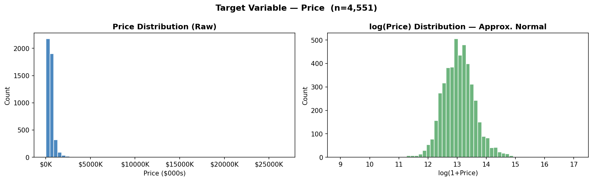

The original price distribution is highly right-skewed. Log transformation produces a near-normal target suitable for regression.

---

## 2. Correlation Analysis

### Feature Correlation Heatmap

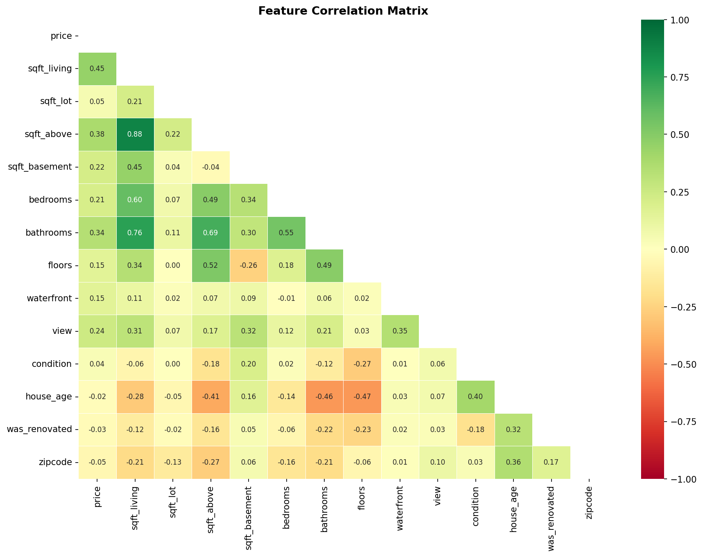

The heatmap reveals strong relationships among area-related variables and highlights important predictors.

---

## 3. Living Area vs Price

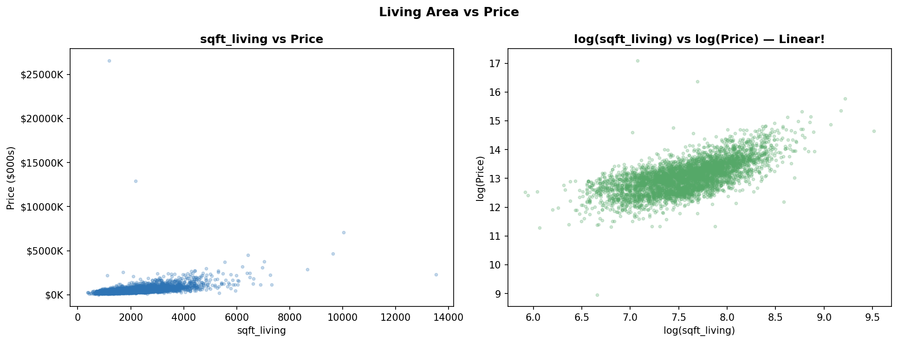

Log transformation creates a much stronger linear relationship between living area and price.

---

## 4. Condition & Waterfront Analysis

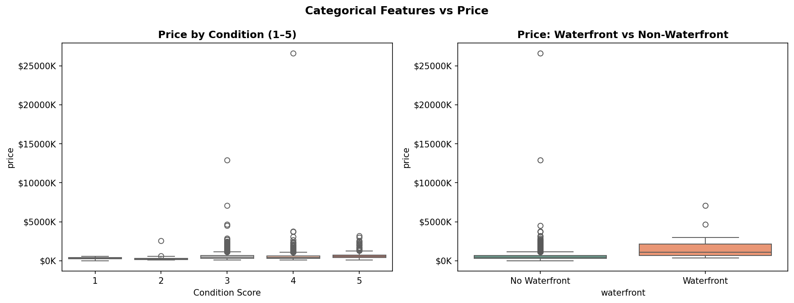

Waterfront homes consistently achieve higher sale prices than non-waterfront properties.

---

## 5. Top Cities by Median Price

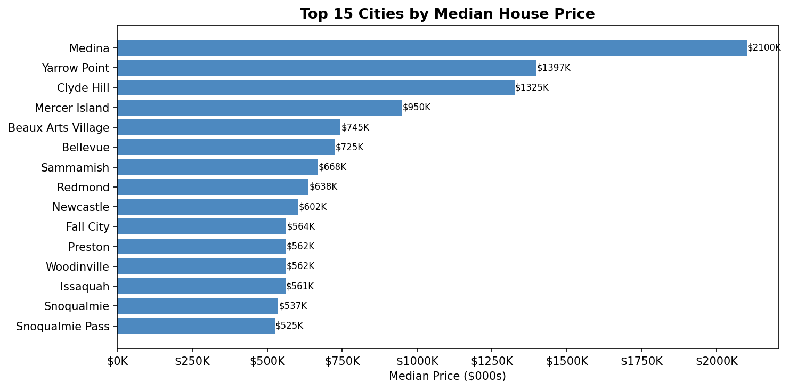

Location is one of the strongest determinants of housing value.

---

## 6. View Score Impact

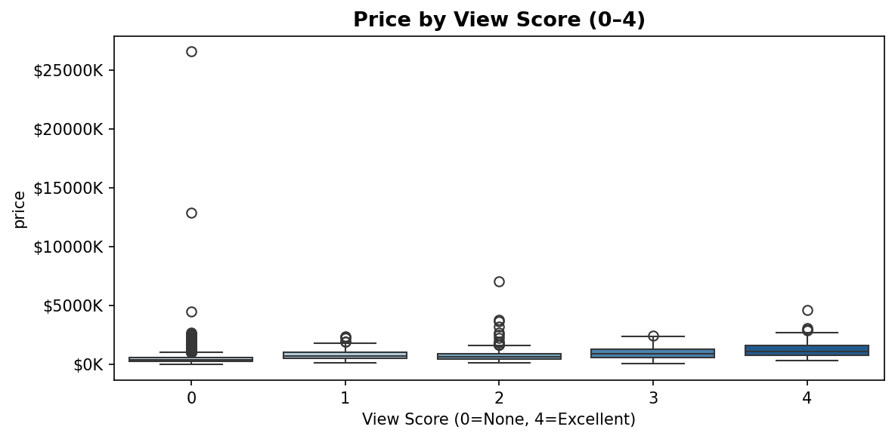

Properties with better views command significantly higher prices.

---

## 7. House Age vs Price

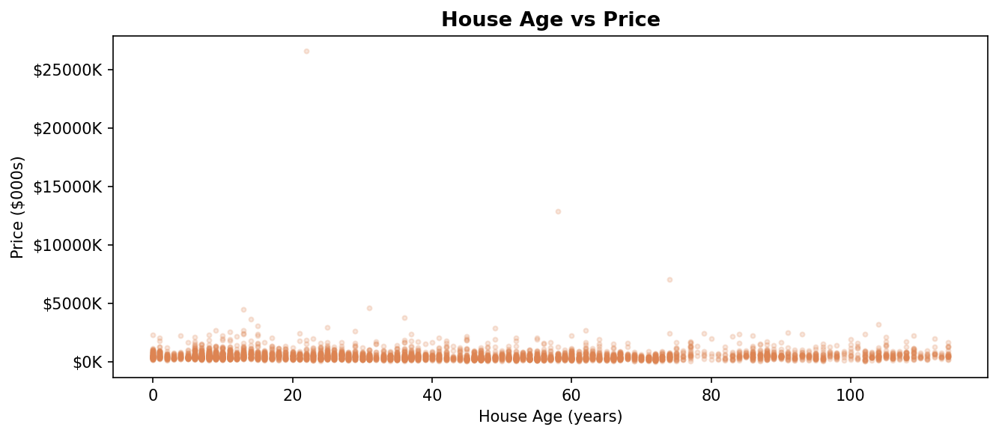

Age alone has limited predictive power compared with size and location features.

---

## 8. Seasonal Trends

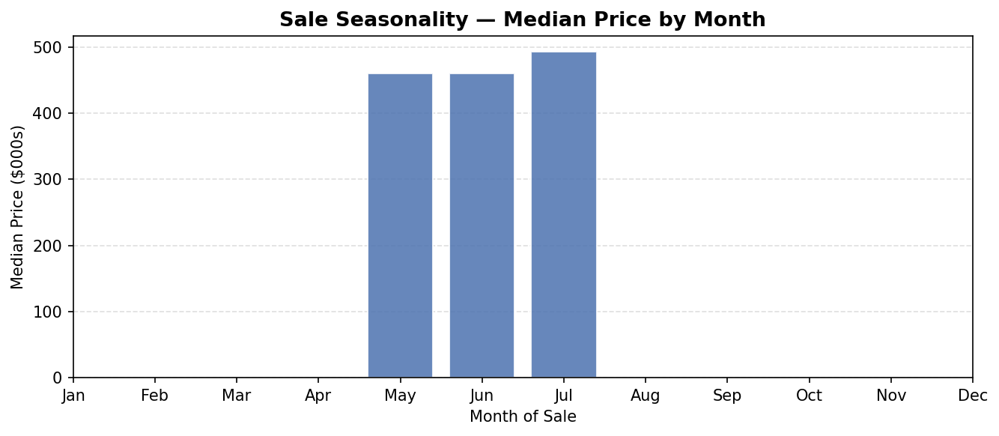

Seasonality exists but is weaker than structural and location-based factors.

---

# Key Findings

## Target Variable

- House prices are heavily right-skewed.
- Log transformation significantly improves normality.
- Log-transformed targets improve model performance.

## Property Size

- sqft_living is the strongest predictor.
- Larger homes consistently sell for higher prices.
- Living area dominates feature importance rankings.

## Location Effects

- Location strongly influences pricing.
- Medina recorded the highest median house price.
- Zipcode and city features improve predictive accuracy.

## Waterfront Properties

- Waterfront homes sell at substantial premiums.
- Waterfront status remains valuable even after controlling for size.

## Scenic Views

- Better view ratings correspond to higher property values.
- View score contributes meaningful predictive information.

## Renovation & Condition

- Renovated properties generally sell for more.
- Better condition scores positively impact value.

## Feature Engineering Impact

- Log transformations improved model behavior.
- Engineered features increased predictive performance.
- Feature engineering contributed significantly to the success of Gradient Boosting.

---

## Machine Learning Models

Three regression algorithms were trained and evaluated.

### 1. Linear Regression
- Baseline interpretable model
- Strong performance after log transformation

### 2. Random Forest Regressor
- Ensemble tree-based model
- Handles nonlinear relationships

### 3. Gradient Boosting Regressor 
- Sequential boosting approach
- Best overall predictive performance

---

# Model Performance

| Model | RMSE ($) | MAE ($) | R² |
|---------|---------:|---------:|---------:|
| Linear Regression | 224,223 | 107,562 | 0.6621 |
| Random Forest | 223,073 | 111,533 | 0.6655 |
| **Gradient Boosting** | **202,924** | **100,290** | **0.7232** |

 Best Model: Gradient Boosting Regressor

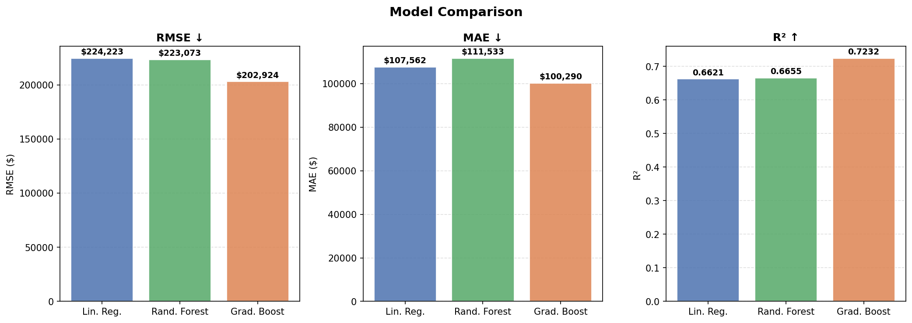

The model explains approximately 72.3% of the variance in housing prices while achieving the lowest prediction error.

---

---

# Prediction Performance

## Actual vs Predicted Prices

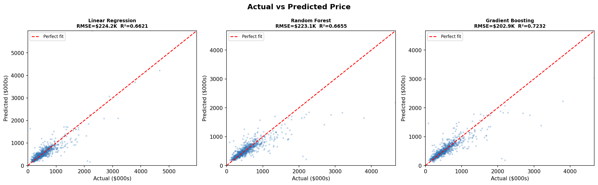

This visualization compares actual house prices against model predictions for all three regression models.

### Observations

- Points closer to the red diagonal line indicate more accurate predictions.
- Linear Regression captures the overall trend but struggles with high-value properties.
- Random Forest improves nonlinear fitting but still underestimates expensive homes.
- Gradient Boosting produces the tightest clustering around the perfect-fit line.
- High-value luxury properties remain the most challenging segment to predict.

### Key Insight

Gradient Boosting demonstrates the strongest predictive capability, providing more accurate estimates across a wider price range.

---

# Residual Analysis

## Residual Plots for All Models

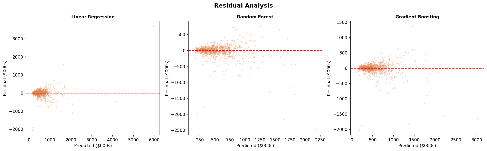

Residuals represent the difference between actual and predicted house prices.

### Observations

#### Linear Regression
- Larger spread of residuals.
- Increasing variance for expensive properties.
- Difficulty capturing complex nonlinear relationships.

#### Random Forest
- Reduced error spread compared with Linear Regression.
- Better handling of nonlinear interactions.
- Some underestimation remains for premium homes.

#### Gradient Boosting
- Residuals are more tightly centered around zero.
- Smaller overall variance.
- Fewer extreme prediction errors.

### Key Insight

Gradient Boosting produces the most stable error distribution, supporting its superior RMSE, MAE, and R² performance.


# Feature Importance

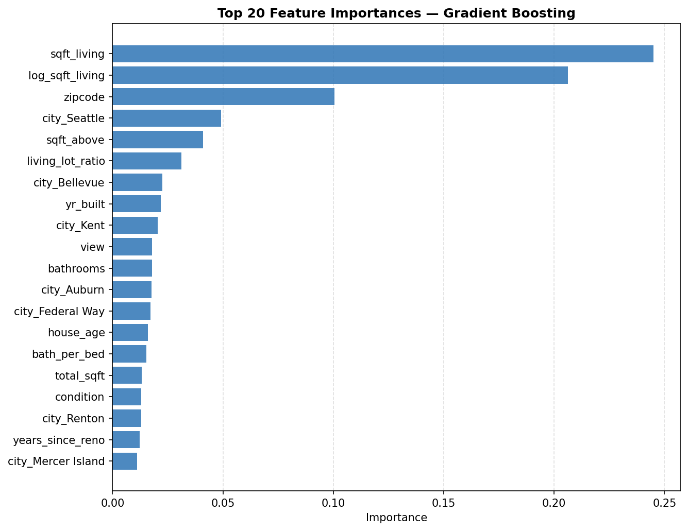

Top contributors:

- sqft_living
- log_sqft_living
- zipcode
- city_Seattle
- sqft_above
- living_lot_ratio

---

# Residual Distribution & Q-Q Plot

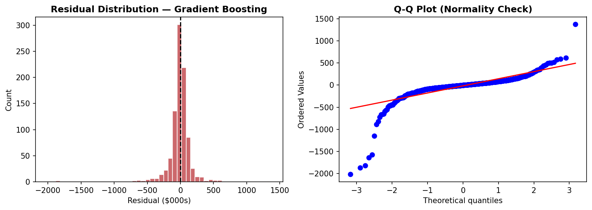

The residual histogram shows that most prediction errors are centered around zero, indicating minimal model bias. The Q-Q plot closely follows the reference line, suggesting that residuals are approximately normally distributed. Minor deviations at the tails indicate a small number of extreme housing prices that are more difficult to predict accurately.

**Key Insight:** The residual distribution and Q-Q plot confirm that the Gradient Boosting model produces stable, well-behaved errors and generalizes effectively across the dataset.

---

## Quick Start

### Clone Repository

```bash
git clone https://github.com/Adnan12919/House-Price-Prediction.git

cd House-Price-Prediction
```

### Install Dependencies

```bash
pip install pandas numpy scikit-learn matplotlib seaborn scipy joblib
```

### Launch Notebook

```bash
jupyter notebook House_price_prediction.ipynb
```

---

## Load Saved Model

```python
import joblib

model = joblib.load("house_price_model.pkl")
```

---

## Project Outcome

This project demonstrates how careful preprocessing, feature engineering, and model selection can significantly improve predictive performance on real-world housing data.

The strongest lesson from this analysis is that feature engineering and location-based information contributed more to performance gains than simply increasing model complexity.

---

# Author

**Adnan Rahman**  

